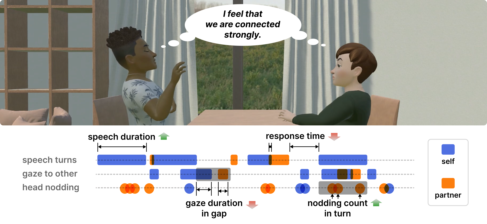

# Quantifying Social Connection in Virtual Reality Conversation

This repository accompanies the CHI 2025 paper [*Quantifying Social Connection in Virtual Reality Conversation*](https://doi.org/10.1145/3706598.3713674). It contains the full analysis pipeline used in the study. The analysis consists of multiple stages of data processing. You can either start from the raw data and follow the scripts step by step, or use the pre-processed datasets. For details, please refer to the README files in each subfolder.

## Preprocessing
The preprocessing folder includes batch scripts to extract audio from recorded videos and to detect voice activity for turn-taking prediction. This step requires running the [`VoiceActivityProjection`](https://github.com/ErikEkstedt/VoiceActivityProjection), `ffmpeg`, `ffmpeg-normalize`.

## Analysis
The analysis folder contains Python notebooks for feature extraction and data formatting for statistical analysis. After preprocessing, the data is analyzed using R, where linear mixed models are fitted and statistical tests are conducted.

## Application for Virtual Reality Conversation
For related applications and implementations in VR conversation scenarios, please refer to [our another repository](https://github.com/hynchl/vr-conversation) linked in this section.

## Data
The overall dataset used in this study can be accessed via [this link](https://www.dropbox.com/scl/fo/g5uri63z2j1n1of6biy55/AGPktcINNe8Ijrdq0c236_4?rlkey=gh3i67fol6e9mfthz2xjni9m3&st=elwb6cmk&dl=0). Additionally, each subfolder contains a README file that provides the corresponding data links required for each processing step.